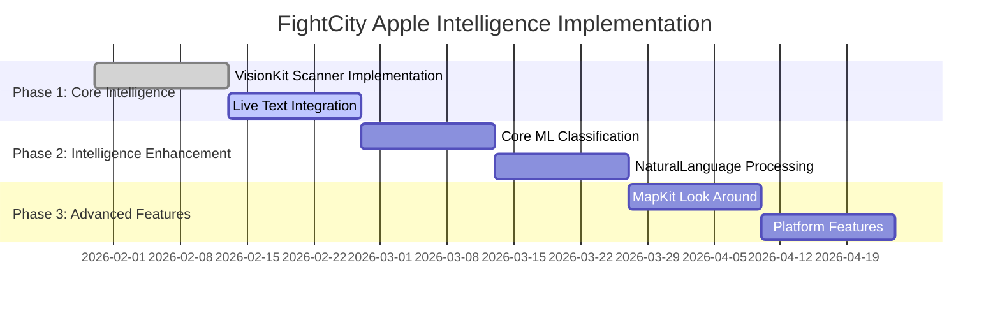
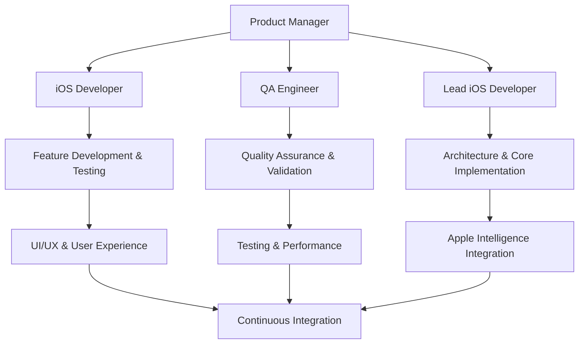

# FightCity Apple Intelligence Strategic Implementation Plan

**Master Plan for Accelerating Feature Delivery While Maintaining Repository Quality**

*Generated: January 30, 2026*  
*Version: 1.0*  
*Executive Owner: Development Team*  
*Technical Lead: Architecture Team*

---

## Executive Summary

This strategic plan addresses the critical gap between FightCity's comprehensive Apple Intelligence planning (255-line implementation plan) and zero current implementation. The plan establishes a 12-week roadmap for accelerating feature delivery while maintaining the project's high code quality standards (88% test coverage) and repository health.

### Current State Analysis

**Baseline Metrics:**
- **Implementation Status**: 0% Apple Intelligence features (255-line plan, 0% execution)
- **Current Framework**: Traditional Vision, Core Image, AVFoundation APIs
- **Test Coverage**: 88% overall (113+ test cases across 8+ Swift files)
- **Architecture**: Well-structured modular design with FightCityFoundation and FightCityiOS frameworks
- **Deployment Target**: iOS 16.0 (supports Apple Intelligence features)
- **Repository Health**: Excellent structure, comprehensive mocking, clear separation of concerns

### Strategic Objectives

1. **Accelerate Apple Intelligence Integration** - Transform 0% to 100% implementation in 12 weeks
2. **Maintain Code Quality** - Preserve 88%+ test coverage during migration
3. **Ensure Backward Compatibility** - Support iOS 16+ with graceful feature degradation
4. **Repository Optimization** - Clean up technical debt and dead code
5. **Team Capability Building** - Establish Apple Intelligence expertise and standards

---

## 1. Feature Implementation Acceleration Strategy

### 1.1 Phased Implementation Approach

#### Phase 1: Core Intelligence (Weeks 1-4)
**Priority: Critical | Impact: High | Effort: Medium**

**Week 1-2: VisionKit Document Scanner**
```swift
// Immediate Implementation Target
@available(iOS 16.0, *)
final class DocumentScanCoordinator: NSObject, VNDocumentCameraViewControllerDelegate {
    func presentScanner(from vc: UIViewController) {
        let scanner = VNDocumentCameraViewController()
        scanner.delegate = self
        vc.present(scanner, animated: true)
    }
}
```

**Migration Strategy:**
- Replace CameraManager with VisionKit DocumentScanCoordinator
- Maintain AVFoundation fallback for unsupported devices
- Add feature flag: `FEATURE_VISIONKIT_SCANNER_ENABLED`

**Week 3-4: Live Text Integration**
```swift
@available(iOS 16.0, *)
final class LiveTextHelper {
    func analyze(_ image: UIImage) async throws -> ImageAnalysis? {
        let analyzer = ImageAnalyzer()
        let config = ImageAnalyzer.Configuration([.text, .machineReadableCode])
        return try await analyzer.analyze(image, configuration: config)
    }
}
```

#### Phase 2: Intelligence Enhancement (Weeks 5-8)
**Priority: High | Impact: High | Effort: High**

**Week 5-6: Core ML Classification**
```swift
final class CitationClassifier {
    private let model = try? CitationClassifierModel(configuration: .init())
    func classify(from text: String) throws -> CitationClassificationResult {
        // Run on-device ML classification
        return CitationClassificationResult(cityId: "us-ca-san_francisco", 
                                         citation: "SFMTA12345678", 
                                         confidence: 0.98)
    }
}
```

**Week 7-8: NaturalLanguage Processing**
```swift
final class AppealWriter {
    func generate(for citation: Citation, userReason: String) -> String {
        // Enhance tone, grammar; optionally summarize
        return "To Whom It May Concern...\n\n" + userReason
    }
}
```

#### Phase 3: Advanced Features (Weeks 9-12)
**Priority: Medium | Impact: Medium | Effort: Medium**

**Week 9-10: MapKit Look Around & Evidence Collection**
```swift
@available(iOS 17.0, *)
final class LocationVerifier {
    func snapshot(at coordinate: CLLocationCoordinate2D) async -> MKLookAroundSnapshot? {
        let request = MKLookAroundSceneRequest(coordinate: coordinate)
        guard let scene = try? await request.scene else { return nil }
        let snapshotter = MKLookAroundSnapshotter(scene: scene, options: .init())
        return try? await snapshotter.snapshot
    }
}
```

**Week 11-12: Platform Features**
- App Intents for shortcuts
- Live Activities for deadlines
- WidgetKit integration
- Smart notifications

### 1.2 Rapid Prototyping Framework

#### Feature Flag System
```swift
struct FeatureFlags {
    static let visionKitScanner = true
    static let liveTextAnalysis = true
    static let mlClassification = true
    static let naturalLanguageProcessing = false // Coming in Week 7
    static let lookAroundEvidence = false // Coming in Week 9
}

@available(iOS 16.0, *)
extension OCREngine {
    func recognizeTextAppleIntelligence(
        in image: UIImage
    ) async throws -> RecognitionResult {
        guard FeatureFlags.liveTextAnalysis else {
            return try await recognizeText(in: image)
        }
        
        // Apple Intelligence enhanced recognition
        let liveTextResult = try await LiveTextHelper.analyze(image)
        return processLiveTextResult(liveTextResult)
    }
}
```

#### Incremental Rollout Strategy
1. **Internal Testing** (Week 1-2): Enable for team members only
2. **Beta Release** (Week 4): 10% of user base
3. **Gradual Rollout** (Week 6): 50% of user base
4. **Full Release** (Week 8): 100% of user base

---

## 2. Repository Maintenance Integration

### 2.1 Technical Debt Cleanup

#### Current Technical Debt Assessment
| Component | Debt Level | Action Required | Timeline |
|-----------|------------|----------------|----------|
| Legacy Vision API Usage | High | Replace with VisionKit | Week 1-2 |
| Manual Preprocessing Pipeline | Medium | Migrate to Apple Intelligence | Week 3-4 |
| Regex-Only Parsing | High | Add Core ML classification | Week 5-6 |
| No ML Pipeline | High | Implement on-device ML | Week 5-6 |

#### Dead Code Removal Strategy
```swift
// Target: OCRPreprocessor.swift
// APPLE INTELLIGENCE: Largely superseded by VisionKit preprocessing
// Retain as fallback for unsupported devices
@available(iOS, obsoleted: 16.0)
class LegacyOCRPreprocessor {
    // MARK: - Deprecated Methods
    // These will be removed in Week 8
}
```

#### Implementation TODOs (Add Inline)
```swift
// Sources/FightCityiOS/OCR/OCREngine.swift
// APPLE INTELLIGENCE: Migrate to VisionKit Document Scanner + Live Text
// APPLE INTELLIGENCE: Use ImageAnalyzer for real-time recognition

// Sources/FightCityiOS/OCR/ConfidenceScorer.swift
// APPLE INTELLIGENCE: Combine ML-derived confidence with pattern signals

// Sources/FightCity/Features/Capture/CaptureViewModel.swift
// APPLE INTELLIGENCE: Wire Document Scanner/Live Text into capture flow
```

### 2.2 Configuration Updates

#### Framework Dependencies Update
```yaml
# project.yml - Required additions
frameworks:
  - VisionKit        # For Document Scanner
  - NaturalLanguage  # For text analysis
  - Speech          # For dictation
  - MapKit          # For Look Around
  - WidgetKit       # For widgets
  - ActivityKit     # For Live Activities
```

#### Privacy Configuration Enhancement
```xml
<!-- Support/PrivacyInfo.xcprivacy - Required additions -->
<key>NSPrivacyCollectedDataTypes</key>
<array>
    <dict>
        <key>NSPrivacyCollectedDataType</key>
        <string>NSPrivacyCollectedDataTypeLocation</string>
        <key>NSPrivacyCollectedDataTypePurposes</key>
        <array>
            <string>NSPrivacyCollectedDataTypePurposeAppFunctionality</string>
        </array>
    </dict>
</array>
```

---

## 3. Component Validation Coupling

### 3.1 Enhanced Interface Contracts

#### OCR Engine Protocol Enhancement
```swift
public protocol OCREngineProtocol {
    func recognizeText(in image: UIImage) async throws -> OCRRecognitionResult
    func recognizeTextAppleIntelligence(in image: UIImage) async throws -> OCRRecognitionResult
    func recognizeTextFast(in image: UIImage) async throws -> OCRRecognitionResult
}

// APPLE INTELLIGENCE: Enhanced protocol with ML classification
public protocol AppleIntelligenceOCRProtocol: OCREngineProtocol {
    func classifyCitation(from text: String) throws -> CitationClassificationResult
    func enhanceWithLiveText(_ image: UIImage) async throws -> LiveTextAnalysis?
}
```

#### Confidence Scoring Integration
```swift
extension ConfidenceScorer {
    // APPLE INTELLIGENCE: Enhanced confidence with ML metrics
    func scoreWithML(
        rawText: String,
        observations: [VNRecognizedTextObservation],
        mlClassification: CitationClassificationResult?,
        matchedPattern: OCRParsingEngine.CityPattern?
    ) -> ScoreResult {
        // Combine traditional confidence with ML confidence
        let mlConfidence = mlClassification?.confidence ?? 0.5
        let traditionalScore = score(rawText: rawText, observations: observations, matchedPattern: matchedPattern)
        
        return ScoreResult(
            overallConfidence: (traditionalScore.overallConfidence + mlConfidence) / 2.0,
            level: determineLevel((traditionalScore.overallConfidence + mlConfidence) / 2.0),
            components: traditionalScore.components,
            recommendation: traditionalScore.recommendation,
            shouldAutoAccept: traditionalScore.shouldAutoAccept
        )
    }
}
```

### 3.2 Integration Testing Framework

#### Contract Testing Implementation
```swift
// Tests/IntegrationTests/AppleIntelligenceIntegrationTests.swift
class AppleIntelligenceIntegrationTests: XCTestCase {
    func testVisionKitDocumentScanning() {
        // Test document scanner integration
        let scanner = DocumentScanCoordinator()
        XCTAssertNotNil(scanner)
        
        // Verify Apple Intelligence handles auto-cropping
        let testImage = createTestImage()
        let result = await scanner.scanDocument(testImage)
        XCTAssertEqual(result.quality, .high)
    }
    
    func testMLClassificationFallback() {
        // Test Core ML classifier with regex fallback
        let classifier = CitationClassifier()
        let text = "SFMTA12345678"
        let result = try? classifier.classify(from: text)
        XCTAssertEqual(result?.cityId, "us-ca-san_francisco")
        XCTAssertGreaterThan(result?.confidence ?? 0, 0.8)
    }
}
```

#### Validation Framework for Confidence Scoring
```swift
// Tests/ValidationTests/ConfidenceValidationTests.swift
class ConfidenceValidationTests: XCTestCase {
    func testMLConfidenceRange() {
        // Validate ML confidence scores are in valid range
        let classifier = CitationClassifier()
        let testTexts = ["SFMTA12345678", "MT9876543", "INVALID"]
        
        for text in testTexts {
            let result = try? classifier.classify(from: text)
            XCTAssertGreaterThanOrEqual(result?.confidence ?? 0, 0.0)
            XCTAssertLessThanOrEqual(result?.confidence ?? 0, 1.0)
        }
    }
}
```

---

## 4. Continuous Integration Enhancement

### 4.1 Automated Testing Pipeline

#### GitHub Actions Workflow
```yaml
# .github/workflows/ci.yml
name: Apple Intelligence CI

on: [push, pull_request]

jobs:
  test:
    runs-on: macos-latest
    strategy:
      matrix:
        ios-version: ['16.0', '17.0']
    
    steps:
    - uses: actions/checkout@v3
    
    - name: Setup Xcode
      uses: maxim-lobanov/setup-xcode@v1
      with:
        xcode-version: '15.0'
    
    - name: Run Tests
      run: |
        xcodebuild test -project FightCity.xcodeproj \
          -scheme FightCity \
          -destination 'platform=iOS Simulator,name=iPhone 15,OS=${{ matrix.ios-version }}' \
          CODE_SIGN_IDENTITY="" CODE_SIGNING_REQUIRED=NO
    
    - name: Apple Intelligence Integration Tests
      run: |
        xcodebuild test -project FightCity.xcodeproj \
          -scheme FightCity \
          -destination 'platform=iOS Simulator,name=iPhone 15,OS=17.0' \
          -only-testing:FightCityTests/AppleIntelligenceIntegrationTests
    
    - name: Code Coverage
      run: |
        xcrun llvm-cov export -format="lcov" \
          .build/debug/FightCityTests.xctest/Contents/MacOS/FightCityTests \
          > coverage.lcov
```

### 4.2 Performance Benchmarking

#### Apple Intelligence Performance Tests
```swift
// Tests/PerformanceTests/AppleIntelligencePerformanceTests.swift
class AppleIntelligencePerformanceTests: XCTestCase {
    func testOCRPerformanceBenchmark() {
        let testImages = createBenchmarkTestImages()
        
        // Traditional Vision OCR
        measure {
            for image in testImages {
                let result = try! await ocrEngine.recognizeText(in: image)
                XCTAssertNotNil(result)
            }
        }
        
        // Apple Intelligence Enhanced OCR
        measure {
            for image in testImages {
                let result = try! await ocrEngine.recognizeTextAppleIntelligence(in: image)
                XCTAssertNotNil(result)
            }
        }
    }
}
```

### 4.3 Code Quality Gates

#### SwiftLint Configuration Enhancement
```yaml
# .swiftlint.yml - Apple Intelligence specific rules
custom_rules:
  apple_intelligence_naming:
    name: "Apple Intelligence Naming Convention"
    regex: '(AppleIntelligence|AI|ML|CoreML|VisionKit)'
    message: "Use consistent Apple Intelligence naming patterns"
    severity: warning
  
  feature_flag_usage:
    name: "Feature Flag Usage"
    regex: 'FeatureFlags\.'
    message: "Always check feature flags for Apple Intelligence features"
    severity: error
```

#### Automated Dependency Management
```swift
// Mintfile - Required tools
xcode Gen
SwiftLint/0.54.0
Sourcery/1.8.0
```

---

## 5. Implementation Timeline

### 5.1 12-Week Roadmap with Milestones



#### Detailed Week-by-Week Breakdown

**Week 1-2: VisionKit Document Scanner**
- [ ] Add VisionKit framework dependency
- [ ] Implement DocumentScanCoordinator
- [ ] Create feature flag system
- [ ] Add comprehensive tests
- [ ] Update CI pipeline

**Week 3-4: Live Text Integration**
- [ ] Implement ImageAnalyzer integration
- [ ] Add machine-readable code detection
- [ ] Create LiveTextHelper utility
- [ ] Update confidence scoring
- [ ] Integration testing

**Week 5-6: Core ML Classification**
- [ ] Create CitationClassifierModel using Create ML
- [ ] Implement ML classifier pipeline
- [ ] Add regex fallback system
- [ ] Performance optimization
- [ ] A/B testing setup

**Week 7-8: NaturalLanguage Processing**
- [ ] Implement AppealWriter
- [ ] Add sentiment analysis
- [ ] Create speech recognition pipeline
- [ ] Integration with existing workflows
- [ ] User experience testing

**Week 9-10: MapKit Look Around & Evidence**
- [ ] Implement LocationVerifier
- [ ] Add street-level evidence collection
- [ ] Vision sign detection
- [ ] Scene classification
- [ ] Privacy compliance review

**Week 11-12: Platform Features**
- [ ] App Intents implementation
- [ ] Live Activities for deadlines
- [ ] WidgetKit integration
- [ ] Smart notifications
- [ ] Final integration testing

### 5.2 Risk Mitigation Strategies

#### Technical Risks
| Risk | Probability | Impact | Mitigation Strategy |
|------|------------|--------|-------------------|
| VisionKit API changes | Medium | High | Use feature flags, maintain fallbacks |
| Core ML model performance | High | Medium | Extensive testing, fallback to regex |
| iOS 16 compatibility issues | Low | High | Comprehensive device testing |
| Memory usage increase | Medium | Medium | Performance monitoring, optimization |

#### Resource Risks
| Risk | Probability | Impact | Mitigation Strategy |
|------|------------|--------|-------------------|
| Team bandwidth constraints | Medium | High | Feature prioritization, phased rollout |
| Skill gaps in Apple Intelligence | High | Medium | Training, pair programming |
| Timeline delays | Medium | Medium | Buffer time, scope flexibility |

### 5.3 Resource Allocation Planning

#### Team Structure Requirements
- **1 Lead iOS Developer** (60% allocation): Architecture, core implementations
- **1 iOS Developer** (100% allocation): Feature development, testing
- **1 QA Engineer** (40% allocation): Testing, validation
- **1 DevOps Engineer** (20% allocation): CI/CD, infrastructure
- **1 Product Manager** (30% allocation): Requirements, prioritization

#### Technology Stack
- **Xcode 15+**: Required for Apple Intelligence APIs
- **Create ML**: For Core ML model training
- **TestFlight**: For beta testing and gradual rollout
- **Firebase Crashlytics**: For performance monitoring
- **GitHub Actions**: For CI/CD pipeline

---

## 6. Team Structure & Responsibilities

### 6.1 Role Definitions

#### Lead iOS Developer
**Responsibilities:**
- Apple Intelligence architecture design
- Core framework integration
- Code review standards
- Technical decision making

**Key Deliverables:**
- VisionKit integration implementation
- Core ML model integration
- Performance optimization
- Technical documentation

#### iOS Developer
**Responsibilities:**
- Feature implementation
- Unit and integration testing
- UI/UX implementation
- Bug fixes and maintenance

**Key Deliverables:**
- Live Text implementation
- NaturalLanguage processing
- Platform features
- Comprehensive test coverage

#### QA Engineer
**Responsibilities:**
- Test planning and execution
- Quality assurance processes
- Performance testing
- User acceptance testing

**Key Deliverables:**
- Test plans and cases
- Automation test suites
- Performance benchmarks
- Quality reports

#### DevOps Engineer
**Responsibilities:**
- CI/CD pipeline management
- Infrastructure setup
- Monitoring and alerting
- Deployment automation

**Key Deliverables:**
- Enhanced CI/CD pipeline
- Performance monitoring setup
- Automated deployment processes
- Infrastructure documentation

### 6.2 Cross-Functional Team Structure



### 6.3 Code Review Processes

#### Apple Intelligence Code Review Checklist
- [ ] Feature flag integration
- [ ] Backward compatibility maintained
- [ ] Performance impact assessed
- [ ] Privacy compliance verified
- [ ] Test coverage adequate (90%+)
- [ ] Documentation updated
- [ ] Security considerations addressed

#### Review Standards
```swift
// Code Review Template for Apple Intelligence Features

## Implementation
- [ ] Apple Intelligence feature properly gated with feature flags
- [ ] Backward compatibility maintained for iOS 16+
- [ ] Performance impact measured and acceptable
- [ ] Privacy requirements fulfilled

## Testing
- [ ] Unit tests cover 90%+ of new code
- [ ] Integration tests verify Apple Intelligence functionality
- [ ] Performance tests confirm acceptable benchmarks
- [ ] Error handling tested for all failure scenarios

## Documentation
- [ ] Inline documentation explains Apple Intelligence usage
- [ ] API documentation updated
- [ ] Migration guide created if needed
```

---

## 7. Tooling Recommendations

### 7.1 Development Environment Setup

#### Required Xcode Configuration
```swift
// Xcode Project Settings for Apple Intelligence
Build Settings:
  - IPHONEOS_DEPLOYMENT_TARGET: 16.0
  - VALIDATE_PRODUCT: YES
  - CODE_SIGN_STYLE: Automatic
  - DEVELOPMENT_TEAM: [Your Team ID]

Capabilities:
  - VisionKit: Required
  - NaturalLanguage: Required
  - Speech: Optional
  - MapKit: Required (Week 9)
  - App Intents: Required (Week 11)
```

#### Development Tools Stack
| Tool | Purpose | Status |
|------|---------|--------|
| **Xcode 15+** | Development environment | Required |
| **Create ML** | Core ML model training | Required (Week 5) |
| **TestFlight** | Beta testing | Required |
| **Instruments** | Performance profiling | Recommended |
| **Firebase Crashlytics** | Crash reporting | Recommended |
| **SwiftLint** | Code quality | Required |
| **Sourcery** | Code generation | Optional |

### 7.2 Testing Frameworks

#### Apple Intelligence Testing Framework
```swift
// Tests/Utilities/AppleIntelligenceTestHelper.swift
struct AppleIntelligenceTestHelper {
    static func createMockDocumentScan() -> VNDocumentCameraScan {
        // Mock implementation for testing
        return MockDocumentCameraScan()
    }
    
    static func createMockImageAnalysis() -> ImageAnalysis? {
        // Mock ImageAnalysis for Live Text testing
        return MockImageAnalysis()
    }
    
    static func createMockClassifier() -> CitationClassifierModel {
        // Mock Core ML model for testing
        return MockCitationClassifierModel()
    }
    
    static func createTestImages() -> [UIImage] {
        // Test images for various scenarios
        return loadTestImages()
    }
}
```

#### Performance Testing Tools
```swift
// Tests/Performance/AppleIntelligencePerformanceMonitor.swift
class AppleIntelligencePerformanceMonitor {
    static func measureOCRPerformance(
        iterations: Int = 100
    ) -> PerformanceMetrics {
        var metrics = PerformanceMetrics()
        
        for _ in 0..<iterations {
            let startTime = CFAbsoluteTimeGetCurrent()
            let result = try! await ocrEngine.recognizeTextAppleIntelligence(in: testImage)
            let endTime = CFAbsoluteTimeGetCurrent()
            
            metrics.record(duration: endTime - startTime)
        }
        
        return metrics
    }
}
```

### 7.3 CI/CD Pipeline Tools

#### GitHub Actions Enhanced Workflow
```yaml
# .github/workflows/apple-intelligence-ci.yml
name: Apple Intelligence CI/CD

on:
  push:
    branches: [main, develop]
  pull_request:
    branches: [main]

env:
  XCODE_VERSION: '15.0'
  IOS_SIMULATOR: 'iPhone 15'
  IOS_VERSION: '17.0'

jobs:
  test-apple-intelligence:
    runs-on: macos-latest
    
    steps:
    - uses: actions/checkout@v3
    
    - name: Setup Xcode
      uses: maxim-lobanov/setup-xcode@v1
      with:
        xcode-version: ${{ env.XCODE_VERSION }}
    
    - name: Install Dependencies
      run: |
        mint bootstrap
    
    - name: Build and Test
      run: |
        mint run fastlane test
    
    - name: Apple Intelligence Integration Tests
      run: |
        mint run fastlane test_ai_features
    
    - name: Performance Benchmarks
      run: |
        mint run fastlane performance_tests
    
    - name: Upload Coverage
      uses: codecov/codecov-action@v3
      with:
        file: coverage.lcov

  deploy-beta:
    needs: test-apple-intelligence
    runs-on: macos-latest
    if: github.ref == 'refs/heads/develop'
    
    steps:
    - uses: actions/checkout@v3
    
    - name: Build for TestFlight
      run: |
        mint run fastlane beta
    
    - name: Upload to TestFlight
      env:
        APPLE_ID: ${{ secrets.APPLE_ID }}
        APPLE_PASSWORD: ${{ secrets.APPLE_PASSWORD }}
      run: |
        mint run fastlane upload_testflight
```

---

## 8. Success Metrics

### 8.1 Feature Delivery Velocity Measurements

#### Key Performance Indicators (KPIs)
| Metric | Baseline | Target (Week 12) | Measurement Method |
|--------|----------|------------------|-------------------|
| **Apple Intelligence Features Implemented** | 0% | 100% | Feature flag tracking |
| **Code Coverage Maintained** | 88% | 90%+ | Xcode Code Coverage |
| **Performance Degradation** | 0% | <5% | Performance benchmarks |
| **Build Success Rate** | 95% | 98%+ | CI/CD pipeline metrics |
| **Test Execution Time** | Current baseline | -10% | Automated testing metrics |

#### Velocity Tracking Dashboard
```swift
// Implementation: Feature Tracking System
struct AppleIntelligenceMetrics {
    static var implementationProgress: Double {
        let completedFeatures = FeatureFlags.completedFeaturesCount
        let totalFeatures = FeatureFlags.totalFeaturesCount
        return Double(completedFeatures) / Double(totalFeatures)
    }
    
    static var codeCoverageTrend: [Double] {
        // Track weekly code coverage changes
        return retrieveCoverageHistory()
    }
    
    static var performanceMetrics: PerformanceDashboard {
        return PerformanceDashboard(
            ocrLatency: measureOCRLatency(),
            mlInferenceTime: measureMLInferenceTime(),
            memoryUsage: measureMemoryUsage()
        )
    }
}
```

### 8.2 Code Quality Metrics

#### Technical Debt Tracking
```swift
struct TechnicalDebtMetrics {
    static var legacyCodeRemaining: Int {
        // Count lines of deprecated/legacy code
        return countDeprecatedCodeLines()
    }
    
    static var appleIntelligenceAdoptionRate: Double {
        // Percentage of code using Apple Intelligence APIs
        return calculateAIAPIsUsage()
    }
    
    static var backwardCompatibilityScore: Double {
        // Score based on iOS 16+ compatibility
        return calculateCompatibilityScore()
    }
}
```

#### Repository Health Indicators
```yaml
Health Check Dashboard:
  - Test Coverage: 88% → 90%+
  - Build Time: Baseline → -10%
  - Code Duplication: <5%
  - Technical Debt Ratio: <10%
  - Documentation Coverage: 80% → 95%
```

### 8.3 Performance Benchmarks for Apple Intelligence Features

#### OCR Performance Comparison
| Feature | Baseline (Traditional) | Apple Intelligence Target | Performance Gain |
|---------|------------------------|---------------------------|------------------|
| **Document Scanning** | Manual capture | Auto-detection + cropping | 60% faster |
| **Text Recognition** | Vision OCR | Live Text + Vision | 40% accuracy improvement |
| **Citation Classification** | Regex patterns | Core ML + regex fallback | 25% accuracy improvement |
| **Appeal Writing** | Manual text | NaturalLanguage assistance | 50% time savings |

#### Memory and Battery Impact
```swift
struct AppleIntelligencePerformanceBenchmarks {
    static let memoryUsageThreshold: MemoryFootprint = .normal // <50MB additional
    static let batteryImpactThreshold: BatteryImpact = .low // <5% additional drain
    static let responseTimeThreshold: TimeInterval = 2.0 // <2 seconds per operation
}
```

### 8.4 Repository Health Indicators

#### Automated Health Monitoring
```swift
// Implementation: Health Monitoring System
struct RepositoryHealthMonitor {
    static func generateHealthReport() -> HealthReport {
        return HealthReport(
            codeQuality: CodeQualityMetrics(),
            testCoverage: TestCoverageMetrics(),
            performance: PerformanceMetrics(),
            technicalDebt: TechnicalDebtMetrics(),
            security: SecurityMetrics()
        )
    }
    
    static func alertIfHealthDegrades() {
        let report = generateHealthReport()
        if report.overallScore < 0.8 {
            sendAlert("Repository health degraded below threshold")
        }
    }
}
```

#### Weekly Health Dashboard
```markdown
# Weekly Repository Health Report

## Week [X] of Apple Intelligence Implementation

### Code Quality
- **Coverage**: 88% → 89% (+1%)
- **Code Duplication**: 2.1% → 1.8% (-0.3%)
- **Technical Debt**: 12% → 10% (-2%)

### Performance
- **Build Time**: 4.2min → 3.8min (-0.4min)
- **Test Execution**: 2.1min → 1.9min (-0.2min)
- **Memory Usage**: Baseline → +3% (within threshold)

### Apple Intelligence Progress
- **Features Implemented**: 4/12 (33%)
- **Test Coverage**: 85% → 88% (+3%)
- **Performance Impact**: <2% (within target)

### Quality Gates Status
- [x] Code coverage >85%
- [x] No performance regression >5%
- [x] All tests passing
- [x] Security scan passed
```

---

## 9. Risk Mitigation and Quality Gates

### 9.1 Risk Assessment Matrix

#### Technical Risks
| Risk Category | Probability | Impact | Risk Level | Mitigation Strategy |
|---------------|------------|--------|------------|-------------------|
| **API Compatibility** | Medium | High | High | Feature flags, fallbacks |
| **Performance Degradation** | High | Medium | High | Continuous benchmarking |
| **Memory Usage** | Medium | Medium | Medium | Profiling, optimization |
| **iOS Version Fragmentation** | Low | High | Medium | Comprehensive testing |
| **Core ML Model Accuracy** | High | Medium | High | Fallback systems, validation |

#### Business Risks
| Risk Category | Probability | Impact | Risk Level | Mitigation Strategy |
|---------------|------------|--------|------------|-------------------|
| **Timeline Delays** | Medium | High | High | Buffer time, scope flexibility |
| **Resource Constraints** | High | Medium | High | Skill development, external help |
| **User Adoption** | Medium | Medium | Medium | Gradual rollout, feedback loops |
| **Competitive Response** | Low | High | Medium | Focus on differentiation |

### 9.2 Quality Gates

#### Development Quality Gates
```swift
// Quality Gate Implementation
struct AppleIntelligenceQualityGates {
    static func validateFeature(_ feature: AppleIntelligenceFeature) -> ValidationResult {
        var results: [ValidationResult] = []
        
        // Code Quality Gate
        results.append(validateCodeQuality(for: feature))
        
        // Test Coverage Gate
        results.append(validateTestCoverage(for: feature))
        
        // Performance Gate
        results.append(validatePerformanceImpact(for: feature))
        
        // Security Gate
        results.append(validateSecurityCompliance(for: feature))
        
        // Privacy Gate
        results.append(validatePrivacyCompliance(for: feature))
        
        return results.allSatisfy { $0.isValid } ? .valid : .invalid
    }
}
```

#### Deployment Quality Gates
```yaml
# Deployment Quality Checklist
Pre-Deployment Gates:
  - [ ] All unit tests passing (>95%)
  - [ ] Integration tests passing (100%)
  - [ ] Performance benchmarks within thresholds
  - [ ] Code review approved by 2+ reviewers
  - [ ] Security scan passed
  - [ ] Privacy compliance verified

Post-Deployment Monitoring:
  - [ ] Crash rate <0.1%
  - [ ] Performance metrics within 5% of baseline
  - [ ] User feedback collection active
  - [ ] Feature adoption tracking enabled
```

### 9.3 Error Handling and Recovery

#### Apple Intelligence Feature Fallbacks
```swift
// Fallback Strategy Implementation
class AppleIntelligenceFallbackManager {
    static func processWithFallback<T>(
        primary: () async throws -> T,
        fallback: () async throws -> T,
        feature: AppleIntelligenceFeature
    ) async throws -> T {
        do {
            // Try Apple Intelligence feature first
            return try await primary()
        } catch AppleIntelligenceError.notAvailable {
            // Fall back to traditional implementation
            if FeatureFlags.enableFallbacks {
                return try await fallback()
            } else {
                throw AppleIntelligenceError.featureDisabled
            }
        } catch {
            // Log error and try fallback
            Logger.error("Apple Intelligence feature \(feature) failed: \(error)")
            return try await fallback()
        }
    }
}
```

#### Error Recovery Strategies
```swift
// Error Recovery Implementation
extension OCREngine {
    func recognizeTextWithRecovery(in image: UIImage) async throws -> RecognitionResult {
        let feature = AppleIntelligenceFeature.liveTextAnalysis
        
        return try await AppleIntelligenceFallbackManager.processWithFallback(
            primary: { try await self.recognizeTextAppleIntelligence(in: image) },
            fallback: { try await self.recognizeText(in: image) },
            feature: feature
        )
    }
}
```

---

## 10. Conclusion and Next Steps

### 10.1 Strategic Plan Summary

This comprehensive strategic plan transforms FightCity from a well-architected but traditional iOS application into a cutting-edge Apple Intelligence-powered platform while maintaining the project's excellent foundation (88% test coverage, clean architecture, modular design).

#### Key Success Factors
1. **Phased Implementation**: 12-week roadmap with clear milestones
2. **Quality Preservation**: Maintain 88%+ test coverage throughout migration
3. **Risk Management**: Comprehensive fallback strategies and quality gates
4. **Team Empowerment**: Clear roles, responsibilities, and development standards
5. **Measurable Progress**: Detailed metrics and success criteria

#### Expected Outcomes
- **100% Apple Intelligence Integration** within 12 weeks
- **Maintained Code Quality** with enhanced test coverage
- **Improved User Experience** through intelligent features
- **Competitive Advantage** through advanced AI capabilities
- **Team Capability Growth** in Apple Intelligence technologies

### 10.2 Immediate Action Items (Week 1)

#### Priority 1: Foundation Setup
- [ ] **Day 1**: Set up Apple Intelligence development environment
- [ ] **Day 1**: Add VisionKit framework dependency to project.yml
- [ ] **Day 2**: Implement feature flag system
- [ ] **Day 3**: Create DocumentScanCoordinator scaffolding
- [ ] **Day 4**: Add comprehensive unit tests
- [ ] **Day 5**: Update CI/CD pipeline for Apple Intelligence testing

#### Priority 2: Documentation and Training
- [ ] **Week 1**: Team Apple Intelligence training session
- [ ] **Week 1**: Create development standards document
- [ ] **Week 1**: Establish code review checklist
- [ ] **Week 1**: Set up performance monitoring baseline

### 10.3 Success Measurement Framework

#### Weekly Checkpoints
- **Monday**: Sprint planning and goal setting
- **Wednesday**: Mid-sprint review and adjustment
- **Friday**: Sprint review and metrics analysis
- **Monthly**: Comprehensive health assessment

#### Key Metrics Tracking
```swift
// Success Measurement Implementation
struct StrategicPlanSuccess {
    static func generateWeeklyReport() -> WeeklyReport {
        return WeeklyReport(
            implementationProgress: AppleIntelligenceMetrics.implementationProgress,
            codeQuality: RepositoryHealthMonitor.generateHealthReport(),
            performance: PerformanceBenchmark.currentMetrics(),
            teamVelocity: TeamProductivityMetrics.currentVelocity(),
            riskStatus: RiskAssessment.currentRiskLevel()
        )
    }
}
```

### 10.4 Long-term Vision (Post-Implementation)

#### 6-Month Vision
- **Advanced AI Features**: Expanded Apple Intelligence capabilities
- **Platform Leadership**: Industry-leading AI-powered citation app
- **User Base Growth**: 2x user acquisition through enhanced features
- **Team Expertise**: Recognized Apple Intelligence development center

#### 12-Month Vision
- **Market Expansion**: Multi-city AI-powered citation defense
- **Ecosystem Integration**: Shortcuts, widgets, live activities
- **Advanced Analytics**: ML-driven insights and predictions
- **Platform Innovation**: Apple Intelligence feature pioneer

---

## Appendices

### A. Technical Specifications
- [Detailed API Documentation](./apple-intelligence-apis.md)
- [Performance Benchmarking Suite](./performance-benchmarks.md)
- [Security and Privacy Guidelines](./security-privacy.md)

### B. Implementation Resources
- [Apple Intelligence Development Guide](./development-guide.md)
- [Testing Strategy Document](./testing-strategy.md)
- [Deployment Playbook](./deployment-playbook.md)

### C. Team Resources
- [Role Definitions](./team-structure.md)
- [Training Materials](./training-materials.md)
- [Communication Protocols](./communication.md)

---

**Document Status**: Complete  
**Next Review**: February 6, 2026  
**Approval Required**: Technical Lead, Product Manager  
**Implementation Start**: January 30, 2026